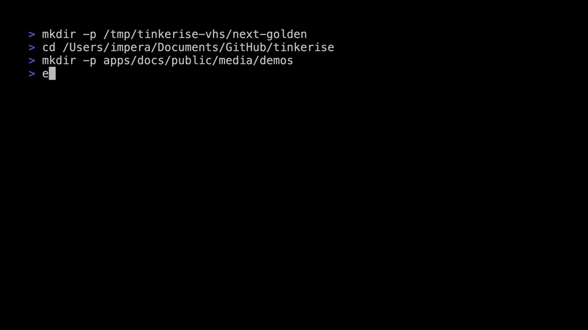

# tinkerise

One command to scaffold any project with any stack.

[](https://github.com/farce1/tinkerise/actions/workflows/ci.yml) [](https://www.npmjs.com/package/tinkerise) [](LICENSE) [](https://nodejs.org)

Wrap official framework scaffolders from one consistent CLI, then keep moving with docs and guided add-ons.



## Start in 30 seconds

```bash
npx tinkerise
tinkerise web next my-app --ts --tailwind --eslint
```

Continue in the full docs: [https://farce1.github.io/tinkerise/](https://farce1.github.io/tinkerise/)

### Alternative install paths

- `npm install -g tinkerise`
- `brew install farce1/tap/tinkerise`

## What is tinkerise?

tinkerise is a unified CLI that wraps official framework scaffolders instead of replacing them. You get one consistent command surface while still relying on the underlying tools maintainers and teams already trust.

## Feature snapshot

- **14 official scaffolders** across web (7), backend (5), and mobile (2)
- **11 enhancement modules** for linting, CI, formatting, testing, Docker, and repo hygiene
- **3 utility templates** (`mcp-server`, `cli-tool`, `npm-lib`) for greenfield tooling work
- **Presets + layered config** so teams can standardize scaffolds without custom wrappers

## Deep dive in docs

- Getting started: [https://farce1.github.io/tinkerise/guides/getting-started/](https://farce1.github.io/tinkerise/guides/getting-started/)
- Scaffolder guides: [https://farce1.github.io/tinkerise/guides/scaffolders/](https://farce1.github.io/tinkerise/guides/scaffolders/)
- Enhancement guides: [https://farce1.github.io/tinkerise/guides/enhancements/](https://farce1.github.io/tinkerise/guides/enhancements/)
- Command reference: [https://farce1.github.io/tinkerise/reference/commands/](https://farce1.github.io/tinkerise/reference/commands/)

For the full guide catalog and recipes, visit [https://farce1.github.io/tinkerise/](https://farce1.github.io/tinkerise/).

## Architecture

- Bun monorepo with Turborepo orchestration
- `packages/cli`: Commander-powered command layer and interactive UX
- `packages/core`: scaffolder registry, execution flow, enhancements, config, and presets
- `packages/shared`: schemas, constants, and shared types
- `packages/tinkerise`: thin npm wrapper that re-exports the scoped CLI package

## Contributing

Contributions are welcome. Start with [CONTRIBUTING.md](CONTRIBUTING.md) and [CODE_OF_CONDUCT.md](CODE_OF_CONDUCT.md), then run the standard Bun scripts from the repository root.

## License

MIT License -- see [LICENSE](LICENSE) for details.
